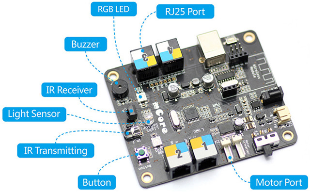

# Componentes del mBot

El mBot V1 (Explorer) es un robot educativo que se compone de varios componentes electrónicos y mecánicos que trabajan juntos para permitir una amplia gama de aplicaciones y proyectos. A continuación, se presentan los componentes clave del mBot:

## Componentes Electrónicos
- **Placa mCore**: La placa principal del mBot, basada en Arduino, que se puede utilizar con lenguajes de programación como Arduino IDE y mBlock.

- **Sensor de luminosidad**: Un sensor que detecta la luz y se utiliza para programar el robot.

- **Emisor y receptor de infrarrojos**: Sensores que permiten la comunicación inalámbrica entre el robot y otros dispositivos.

- **Dos luces LED RGB**: Luces que emiten cualquier color y se utilizan para programar el robot.

- **Zumbador**: Un dispositivo que emite notas musicales y se utiliza para programar el robot.

- **Pulsador programable**: Un botón que se puede programar para realizar diferentes acciones.

- **Sensor de proximidad por ultrasonidos**: Un sensor que detecta objetos y distancias con precisión.

- **Sensor sigue-líneas**: Un sensor que sigue líneas y se utiliza para programar el robot.

- **Módulo Bluetooth**: Un módulo que permite la conexión inalámbrica con dispositivos móviles y computadoras.

## Componentes Mecánicos
- **Micro motores TT**: Motores eléctricos que proporcionan movimiento y velocidad al robot.

- **Cables y conectores**: Cables y conectores que se utilizan para conectar los componentes electrónicos y mecánicos.

## Componentes de Expansión
- **Matriz de LEDs 8×16**: Una matriz de luces que se puede utilizar para crear patrones y efectos visuales.

- **Servomotor**: Un motor que se puede utilizar para controlar el movimiento de partes del robot.

- **Mini Gripper**: Un dispositivo que se puede utilizar para agarrar objetos.

- **Mini brazo articulado**: Un brazo que se puede utilizar para realizar movimientos precisos.

- **Sensor de sonido**: Un sensor que detecta sonidos y se utiliza para programar el robot.

- **Potenciómetro**: Un dispositivo que se utiliza para medir la resistencia eléctrica.

- **Display 4 dígitos 7 segmentos**: Un display que se utiliza para mostrar información numérica.

- **Micro Switch**: Un interruptor que se utiliza para controlar el flujo de corriente eléctrica.

- **Joystick**: Un dispositivo que se utiliza para controlar el movimiento del robot.

Estos componentes trabajan juntos para permitir una amplia gama de aplicaciones y proyectos en robótica, programación y tecnología.

Citations:
[1] https://www.zambeca.cl/tiendaOficial/documentos/MakeBlock/mBotV1.1Bluetooth.pdf
[2] https://www.zambeca.cl/tiendaOficial/index.php?product_id=1297&route=product%2Fproduct
[3] https://juegosrobotica.es/mbot/
[4] https://cdtechnologia.net/makeblock/1516-vehiculo-carro-3-ruedas-mbot-v11-bluebluetooth-version-makeblock-0001516.html
[5] https://creativashop.com/products/copia-de-mbot-v1-1-blue-2-4g-version